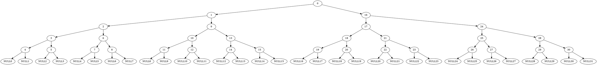

```dot
digraph tree{
0 -> 1
0 -> 16
1 -> 2
1 -> 9
2 -> 3
2 -> 6
3 -> 4
3 -> 5
4 -> NULL0
4 -> NULL1
5 -> NULL2
5 -> NULL3
6 -> 7
6 -> 8
7 -> NULL4
7 -> NULL5
8 -> NULL6
8 -> NULL7
9 -> 10
9 -> 13
10 -> 11
10 -> 12
11 -> NULL8
11 -> NULL9
12 -> NULL10
12 -> NULL11
13 -> 14
13 -> 15
14 -> NULL12
14 -> NULL13
15 -> NULL14
15 -> NULL15
16 -> 17
16 -> 24
17 -> 18
17 -> 21
18 -> 19
18 -> 20
19 -> NULL16
19 -> NULL17
20 -> NULL18
20 -> NULL19
21 -> 22
21 -> 23
22 -> NULL20
22 -> NULL21
23 -> NULL22
23 -> NULL23
24 -> 25
24 -> 28
25 -> 26
25 -> 27
26 -> NULL24
26 -> NULL25
27 -> NULL26
27 -> NULL27
28 -> 29
28 -> 30
29 -> NULL28
29 -> NULL29
30 -> NULL30
30 -> NULL31
NULL0[lable=""]
NULL1[lable=""]
NULL2[lable=""]
NULL3[lable=""]
NULL4[lable=""]
NULL5[lable=""]
NULL6[lable=""]
NULL7[lable=""]
NULL8[lable=""]
NULL9[lable=""]
NULL10[lable=""]
NULL11[lable=""]
NULL12[lable=""]
NULL13[lable=""]
NULL14[lable=""]
NULL15[lable=""]
NULL16[lable=""]
NULL17[lable=""]
NULL18[lable=""]
NULL19[lable=""]
NULL20[lable=""]
NULL21[lable=""]
NULL22[lable=""]
NULL23[lable=""]
NULL24[lable=""]
NULL25[lable=""]
NULL26[lable=""]
NULL27[lable=""]
NULL28[lable=""]
NULL29[lable=""]
NULL30[lable=""]
NULL31[lable=""]
}
```